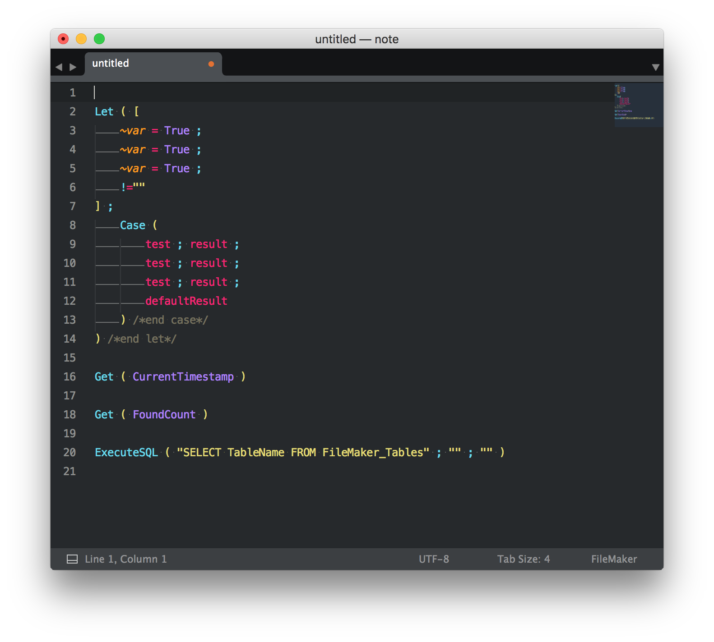

filemaker-syntax
================

FileMaker Sublime Syntax Highlighting

Getting Started
===============

clone
-----

    cd Library/Application Support/Sublime Text 3/Packages
    git clone https://github.com/frudens/filemaker-syntax.git

edit filemaker.sublime-settings
-------------------------------

    {
    	"extensions":
    	[
    		"txt",
    		"calc",
    		"fmfn",
    		"fmt"
    	]
    }

image
-----

Contact
=======

Teruhiro Komaki

komaki at frudens.jp
